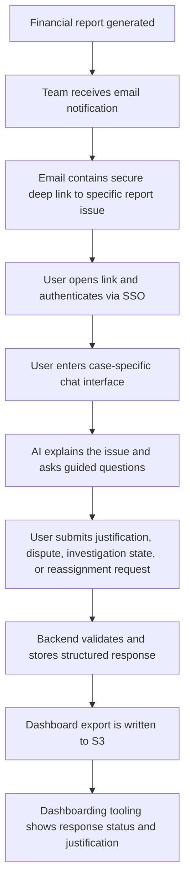
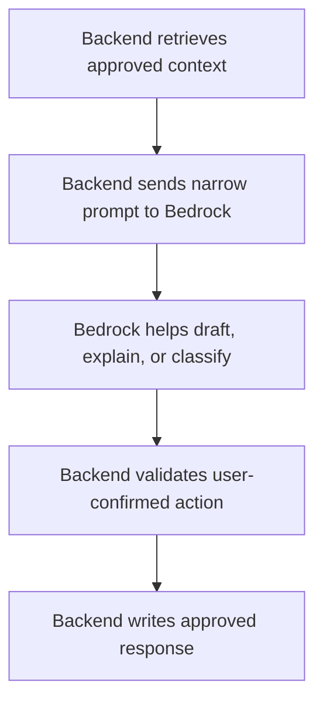
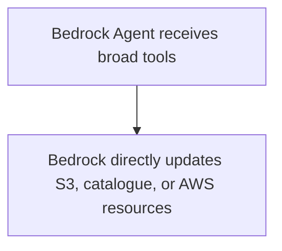
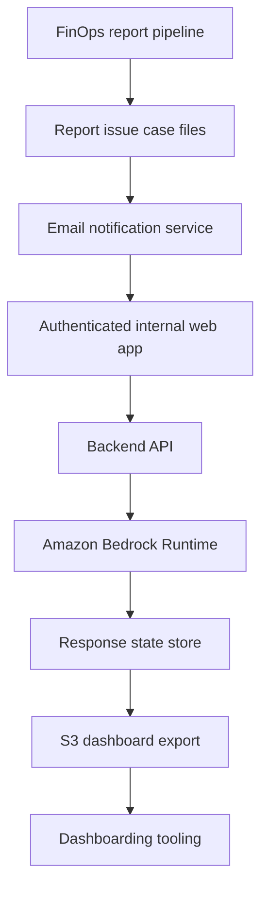

# AI-Assisted FinOps Report Response Portal

## Purpose

This document describes a proposed design for a controlled, AI-assisted FinOps report response workflow suitable for a highly locked-down enterprise AWS environment.

The proposed system allows teams to respond to financial report items through a secure, linked chat interface. The assistant helps users understand the report item, provide a justification, challenge the assignment, or request reassignment to a different technology catalogue owner. The system captures structured responses and publishes approved response data to S3 for dashboarding.

The design intentionally avoids broad AWS access, autonomous remediation, direct infrastructure changes, and direct technology catalogue mutation.

## Executive Summary

The proposed solution is an **AI-assisted FinOps Report Response Portal**.

Each FinOps report item generates a secure deep link in an email notification. The user clicks the link, authenticates via enterprise SSO, and is taken to a case-specific chat interface. The AI assistant explains the report item using a narrow, pre-built case file, asks guided questions, and helps the user submit one of several controlled responses:

- Provide a justification.
- Challenge the financial allocation.
- Request reassignment to a different product, application, team, or technology catalogue entry.
- Mark the issue as needing further investigation.
- Attach supporting evidence.

The backend validates all actions, stores a structured response, writes an audit trail, and publishes dashboard-ready data to S3.

The model does **not** receive broad AWS service permissions. Bedrock is used only as a controlled reasoning and drafting layer. The application backend owns all reads, writes, validation, and authorisation.

## Recommended Internal Name

Suggested name:

**FinOps Response Portal**

Alternative names:

- FinOps Justification Portal
- FinOps Assignment Validation Workflow
- AI-Assisted FinOps Response Workflow
- Cloud Cost Response Portal

Avoid names such as:

- Autonomous FinOps Agent
- AI Cost Remediation Agent
- Bedrock S3 Agent

Those names imply more autonomy and risk than the design requires.

## Problem Statement

Enterprise FinOps reporting often identifies cost anomalies, allocation issues, unexplained variances, and ownership problems. However, the response process is commonly fragmented across email threads, spreadsheets, meetings, and manual dashboard updates.

This creates several problems:

| Problem                                        | Impact                                                       |
| ---------------------------------------------- | ------------------------------------------------------------ |
| Justifications are captured inconsistently     | Dashboard commentary becomes stale or incomplete             |
| Ownership challenges happen via email          | No clear audit trail or structured reassignment workflow     |
| Teams lack context when receiving reports      | More time spent asking FinOps to explain the issue           |
| Finance and engineering use different language | Poor translation between technical cause and financial impact |
| Responses are difficult to aggregate           | Hard to show status, acceptance, disputes, and remediation progress |
| Manual chasing is required                     | FinOps team spends time coordinating instead of analysing    |

## Proposed Solution

The solution is a controlled web-based workflow that combines:

- A secure email deep link for each report item.
- Enterprise SSO authentication.
- Case-specific AI-assisted chat.
- Structured response capture.
- Optional reassignment request workflow.
- S3 dashboard export.
- Full audit logging.

The AI assistant is not a general-purpose chatbot. It is scoped to the specific report item and allowed actions for the authenticated user.

## High-Level User Journey



## Security-Centred Architecture View

```security-architecture
User -> Internal Web App / API: SSO-authenticated HTTPS
Internal Web App / API -> S3 Report Issue Case Files: read narrow case context
Internal Web App / API -> Technology Catalogue: read assignment metadata
Internal Web App / API -> Amazon Bedrock Runtime: invoke approved model only
Internal Web App / API -> S3 Response State Store: write validated response state
Internal Web App / API -> S3 Dashboard Export: write approved export prefix
Internal Web App / API -> S3 Audit Logs: write views, submissions, model events
Amazon Bedrock Runtime -> Guardrail Boundary: no direct AWS writes, no catalogue mutation, no remediation
```

## Key Design Principle

The application backend performs all reads and writes.

Bedrock receives only a narrow case file and returns assisted text, classifications, questions, or structured suggestions.

The backend validates the user, the issue, the requested action, and the final response schema before writing anything.

The design should be:



It should not be:



## Scope of the MVP

### In Scope

| Capability           | Description                                           |
| -------------------- | ----------------------------------------------------- |
| Email deep link      | Link users to a specific report issue                 |
| Enterprise SSO       | Authenticate users before access                      |
| Case-specific chat   | Chat only about the linked report item                |
| Issue explanation    | AI explains the cost movement and current assignment  |
| Guided justification | AI helps users provide a structured response          |
| Reassignment request | User can suggest a different product/application/team |
| Investigation state  | User can mark the item as needing investigation       |
| S3 dashboard export  | Structured response written for dashboard consumption |
| Audit logging        | Record who did what, when, and against which issue    |
| Role-based access    | Users see and update only authorised issues           |

### Out of Scope for MVP

| Not Required                                      | Reason                                              |
| ------------------------------------------------- | --------------------------------------------------- |
| Direct access to raw CUR                          | Upstream report process should create a case file   |
| Access to EC2, RDS, EKS, or other live infra APIs | App is not inspecting or modifying infrastructure   |
| IAM mutation                                      | App does not manage permissions                     |
| Direct technology catalogue updates               | Only reassignment requests are created              |
| Autonomous remediation                            | Human-led response workflow only                    |
| Broad natural language access to all cost data    | Case-specific interaction only                      |
| Public internet egress                            | Private endpoints and approved internal routes only |
| Static AWS access keys                            | SSO and IAM roles only                              |
| Broad Bedrock model access                        | One approved model for MVP                          |
| Cross-team visibility by default                  | Enforced RBAC/ABAC                                  |
| Browser-based direct S3 writes                    | Backend-only writes                                 |

## Core Response Types

| Response Type        | Description                                                  | Output                       |
| -------------------- | ------------------------------------------------------------ | ---------------------------- |
| Justification        | Team accepts the cost and explains why it occurred           | Structured justification     |
| Dispute              | Team challenges the data, amount, or allocation              | Dispute record               |
| Reassignment request | Team believes another product/application/team owns the cost | Pending reassignment request |
| Needs investigation  | Team cannot yet explain the item                             | Pending investigation status |
| Evidence attachment  | Team adds supporting links or references                     | Evidence metadata            |

## Suggested Status Model

| Status                   | Meaning                                                   |
| ------------------------ | --------------------------------------------------------- |
| `awaiting_response`      | Team has not responded                                    |
| `in_discussion`          | Chat has started but no final response has been submitted |
| `justified`              | Team accepted and justified the cost                      |
| `disputed`               | Team challenges the data or allocation                    |
| `reassignment_requested` | Team proposed a different owner                           |
| `pending_finops_review`  | Requires FinOps review                                    |
| `pending_catalog_update` | Requires technology catalogue review/update               |
| `closed`                 | No further action required                                |
| `expired`                | No response received by due date                          |

## Suggested Justification Categories

| Category                            | Description                                               |
| ----------------------------------- | --------------------------------------------------------- |
| `expected_business_growth`          | Spend increased due to genuine demand                     |
| `planned_project_activity`          | Temporary or planned project activity                     |
| `seasonal_usage`                    | Expected seasonal pattern                                 |
| `incident_or_resilience_event`      | Cost increased due to incident, failover, DR, or recovery |
| `deployment_or_architecture_change` | Change in system design, deployment, or scaling behaviour |
| `temporary_testing_or_migration`    | Short-term engineering activity                           |
| `waste_or_inefficiency`             | Team accepts that optimisation is needed                  |
| `incorrect_assignment`              | Wrong product, application, team, or cost centre mapping  |
| `unknown_needs_investigation`       | Team cannot currently explain the issue                   |
| `data_quality_issue`                | Report data appears incorrect or incomplete               |

## Example User Flow

```conversation
AI:
This report item relates to a £18.5k month-on-month increase in EC2 costs for the Checkout API in the Payments product.

The current assignment is:
Product: Payments
Application: Checkout API
Team: Payments Platform

The main drivers appear to be:
- Increased running hours for c7g.4xlarge instances
- Higher EBS gp3 usage
- Increased production autoscaling floor from 6 to 10 nodes

How would you like to respond?

User:
This is expected. We onboarded two large merchants and raised capacity.

AI:
Thanks. Is this increase expected to continue next month?

User:
Yes, it is now baseline.

AI:
Would you classify this as expected business growth?

User:
Yes.

AI:
I will record this as an accepted justification:
- Category: Expected business growth
- Duration: Ongoing
- Reason: New merchant onboarding increased required production capacity
- Status: Justified

Do you want to submit this?
```

The final submit action is handled by deterministic backend logic, not by the model directly.

## Example Reassignment Flow

```conversation
User:
This belongs to Data Platform, not us.

AI:
I can raise a reassignment request. Which application or team do you believe owns it?

User:
Customer Insights ETL.

AI:
I found "Customer Insights ETL" in the technology catalogue, owned by Data Platform.

I will create a reassignment request from:
Payments / Checkout API / Payments Platform

to:
Customer Insights / Customer Insights ETL / Data Platform

This will require FinOps or catalogue-owner approval before the dashboard assignment changes.

Do you want to submit this reassignment request?
```

## Recommended Architecture



## Component Responsibilities

| Component                  | Responsibility                                               |
| -------------------------- | ------------------------------------------------------------ |
| Report pipeline            | Generates report issue case files                            |
| Email notification service | Sends team-specific deep links                               |
| Web frontend               | Provides chat interface and issue view                       |
| Backend API                | Performs authz, case retrieval, Bedrock invocation, validation, writes |
| Bedrock Runtime            | Generates explanations, questions, summaries, and structured drafts |
| Response state store       | Stores canonical response state                              |
| S3 export bucket/prefix    | Provides dashboard-ready response data                       |
| Dashboard tooling          | Displays response status, commentary, and reassignment state |
| Audit log                  | Records all views, submissions, model interactions, and writes |

## Recommended Storage Design

### Preferred

| Data                     | Recommended Store         |
| ------------------------ | ------------------------- |
| Current case state       | DynamoDB or RDS/Postgres  |
| Conversation state       | DynamoDB or RDS/Postgres  |
| Structured justification | DynamoDB or RDS/Postgres  |
| Dashboard export         | S3                        |
| Analytics                | Athena/Glue over S3       |
| Long-term audit          | CloudWatch Logs and/or S3 |

### S3-Only Fallback

If the enterprise insists on S3 as the main integration point:

| Data             | Store                     |
| ---------------- | ------------------------- |
| Current response | S3 object                 |
| Response history | Append-only S3 objects    |
| Dashboard output | S3 partitioned data       |
| Audit            | CloudWatch and/or S3 logs |

S3 should be treated as the dashboard/export layer where possible, not the primary transactional workflow store.

## Example Data Model

### Cost Issue Record

```json
{
  "issue_id": "finops-2026-05-001234",
  "report_id": "monthly-cloud-report-2026-05",
  "report_period": "2026-05",
  "status": "awaiting_response",
  "assigned_team": "Payments Platform",
  "assigned_application": "Checkout API",
  "assigned_product": "Payments",
  "aws_account_id": "123456789012",
  "service": "AmazonEC2",
  "cost_delta": 18500.25,
  "cost_delta_percentage": 32.4,
  "currency": "GBP",
  "summary": "EC2 spend increased materially versus prior month.",
  "response_due_date": "2026-06-07"
}
```

### Justification Response

```json
{
  "issue_id": "finops-2026-05-001234",
  "response_id": "resp-001",
  "response_type": "justification",
  "submitted_by": "user@company.com",
  "submitted_at": "2026-05-21T14:30:00Z",
  "team": "Payments Platform",
  "justification_category": "expected_business_growth",
  "business_reason": "Traffic increased due to new merchant onboarding.",
  "technical_reason": "Additional ECS capacity was required for the checkout service.",
  "expected_to_continue": true,
  "expected_duration": "ongoing",
  "requires_finops_review": false,
  "confidence": "medium",
  "supporting_links": [
    "https://internal/change/CHG12345"
  ],
  "ai_summary": "The team states the increase is expected and linked to merchant onboarding and increased checkout demand."
}
```

### Reassignment Request

```json
{
  "issue_id": "finops-2026-05-001234",
  "response_type": "reassignment_request",
  "submitted_by": "user@company.com",
  "submitted_at": "2026-05-21T14:35:00Z",
  "current_assignment": {
    "product": "Payments",
    "application": "Checkout API",
    "team": "Payments Platform"
  },
  "proposed_assignment": {
    "product": "Customer Analytics",
    "application": "Reporting Pipeline",
    "team": "Data Platform"
  },
  "reason": "The resources are tagged with the old Payments cost centre but are used by the reporting pipeline.",
  "requires_catalog_update": true,
  "status": "pending_review"
}
```

### Dashboard Export Record

```json
{
  "report_period": "2026-05",
  "issue_id": "finops-2026-05-001234",
  "product": "Payments",
  "application": "Checkout API",
  "team": "Payments Platform",
  "service": "AmazonEC2",
  "cost_delta": 18500.25,
  "status": "justified",
  "response_type": "expected_business_growth",
  "response_summary": "Increase accepted as expected business growth due to new merchant onboarding.",
  "submitted_by": "user@company.com",
  "submitted_at": "2026-05-21T14:30:00Z",
  "requires_finops_review": false,
  "requires_catalog_update": false
}
```

## Recommended S3 Layout

```text
s3://<bucket>/report-issues/report_period=2026-05/issue_id=...json
s3://<bucket>/responses-current/report_period=2026-05/issue_id=...json
s3://<bucket>/responses-history/report_period=2026-05/issue_id=.../event_ts=...json
s3://<bucket>/dashboard-export/report_period=2026-05/team=.../part-....parquet
```

For dashboarding, Parquet is preferable to many individual JSON files if the data will be queried through Athena, QuickSight, Power BI, Tableau, or similar tooling.

## AI Responsibilities

The AI assistant should help with:

| Function             | Description                                          |
| -------------------- | ---------------------------------------------------- |
| Issue explanation    | Explain the financial report item in plain English   |
| Guided response      | Ask the user for the minimum useful justification    |
| Classification       | Convert free text into controlled categories         |
| Reassignment support | Suggest matching catalogue entries where appropriate |
| Dashboard summary    | Produce concise finance-friendly commentary          |
| FAQ support          | Explain methodology, assignment, and terminology     |

The AI should not:

| Prohibited Behaviour                     | Reason                           |
| ---------------------------------------- | -------------------------------- |
| Directly write to S3                     | Backend must validate writes     |
| Directly update the technology catalogue | Reassignment requires review     |
| Directly modify infrastructure           | Out of scope and high risk       |
| Invent causes without evidence           | Reduces trust and increases risk |
| Access unrelated team data               | Violates least privilege         |
| Act without user confirmation            | Workflow must be human-led       |

## Prompt Context Pattern

The model should receive a compact case file, not raw CUR data.

Example:

```json
{
  "task": "Assist the user in responding to a FinOps report issue.",
  "issue": {
    "issue_id": "finops-2026-05-001234",
    "summary": "EC2 spend increased by £18.5k month-on-month.",
    "current_assignment": {
      "product": "Payments",
      "application": "Checkout API",
      "team": "Payments Platform"
    },
    "detected_drivers": [
      "c7g.4xlarge running hours increased 41%",
      "EBS gp3 storage increased 19%",
      "Autoscaling minimum capacity appears to have increased"
    ],
    "known_events": [
      "Change CHG12345: raised production capacity",
      "Release 2026.05.14: merchant onboarding changes"
    ]
  },
  "allowed_actions": [
    "submit_justification",
    "request_reassignment",
    "mark_needs_investigation",
    "attach_evidence"
  ],
  "policy": {
    "do_not_claim_certainty_without_evidence": true,
    "ask_for_confirmation_before_submission": true,
    "do_not_update_catalog_directly": true
  }
}
```

## Guardrails and Validation

Controls should exist both at the application level and, where appropriate, through Bedrock Guardrails.

| Control                                | Implementation                              |
| -------------------------------------- | ------------------------------------------- |
| User must authenticate                 | Enterprise SSO                              |
| User must be authorised for issue      | Application RBAC/ABAC                       |
| AI only receives case-specific context | Backend context builder                     |
| No unsupported certainty               | Prompt rules and output validation          |
| No direct catalogue mutation           | Workflow design and IAM restrictions        |
| Confirmation before submit             | Application UX                              |
| Structured output schema               | JSON schema validation                      |
| Sensitive data redaction               | Application preprocessing and/or guardrails |
| Audit trail                            | Application audit events and logs           |
| Prompt/output retention decision       | Security-approved logging policy            |

## AWS Enablement Checklist

The following sections list the AWS and enterprise enablement items that should be explicitly requested. In this organisation, do not assume implied dependencies will be granted automatically.

## 1. AWS Account and Region

| Requirement            | Request                                               | Notes                                                        |
| ---------------------- | ----------------------------------------------------- | ------------------------------------------------------------ |
| AWS account            | Dedicated workload account or approved shared account | Prefer separate non-prod and prod                            |
| Region                 | Approved Bedrock-supported region                     | Must satisfy data residency requirements                     |
| Environment separation | Dev/test/prod or equivalent                           | At minimum non-prod and prod                                 |
| SCP exceptions         | Allow approved services and actions                   | Many enterprises block AI and Marketplace services by default |
| Mandatory tags         | Apply enterprise tagging standard                     | Application, owner, cost centre, environment, data classification |

## 2. Bedrock Access

| Requirement              | Exact Ask                                      |
| ------------------------ | ---------------------------------------------- |
| Enable Amazon Bedrock    | In selected account and region                 |
| Model approval           | Approve one text model for MVP                 |
| Model invocation         | Allow runtime role to invoke approved model    |
| Streaming                | Decide whether streaming responses are allowed |
| Marketplace/legal review | Required if using third-party model provider   |
| Guardrails               | Create/approve guardrail if required           |
| Invocation logging       | Enable if required by security                 |

Minimum runtime actions:

```json
{
  "Effect": "Allow",
  "Action": [
    "bedrock:InvokeModel",
    "bedrock:InvokeModelWithResponseStream"
  ],
  "Resource": [
    "arn:aws:bedrock:<region>::foundation-model/<approved-model-id>"
  ]
}
```

If using the Bedrock Converse API, include equivalent model invocation permissions as required by the selected SDK/API pattern.

## 3. Bedrock Network Connectivity

For a no-internet environment, request Bedrock PrivateLink access.

| Endpoint                                       |               Required? | Purpose                                     |
| ---------------------------------------------- | ----------------------: | ------------------------------------------- |
| `com.amazonaws.<region>.bedrock-runtime`       |                     Yes | Model invocation                            |
| `com.amazonaws.<region>.bedrock`               |                   Maybe | Control-plane/list/configuration operations |
| `com.amazonaws.<region>.bedrock-agent-runtime` |    Only if using Agents | Invoke Bedrock Agent                        |
| `com.amazonaws.<region>.bedrock-agent`         | Only if managing Agents | Agent build/configuration                   |

For MVP, request only what is needed:

```text
com.amazonaws.<region>.bedrock-runtime
```

Network details:

| Item                      | Required                                                     |
| ------------------------- | ------------------------------------------------------------ |
| Interface VPC endpoint    | Bedrock Runtime                                              |
| Private DNS               | Enabled                                                      |
| Endpoint security group   | Allow TCP 443 from app runtime security group                |
| App security group egress | Allow TCP 443 to endpoint security group                     |
| Endpoint policy           | Restrict to approved principals/actions/models where possible |
| DNS resolution            | Must work from app runtime, bastion, and CI runner if applicable |
| Route dependency          | No NAT or public internet dependency                         |

## 4. Runtime Hosting

Choose one runtime pattern.

### Recommended Options

| Runtime                        | Good For                     | Notes                                    |
| ------------------------------ | ---------------------------- | ---------------------------------------- |
| ECS Fargate                    | Internal web app/API         | Good balance of control and simplicity   |
| Lambda + API Gateway           | Lightweight MVP              | May be sufficient for simple workflows   |
| Existing internal app platform | Enterprise alignment         | Often easiest to approve                 |
| EKS                            | Existing Kubernetes platform | More dependencies and operational burden |

### ECS Fargate Requirements

| Resource                         | Required                        |
| -------------------------------- | ------------------------------- |
| ECS cluster                      | Existing or new                 |
| ECS service                      | Runs the backend                |
| Task execution role              | Pull image and write logs       |
| Task runtime role                | Bedrock/data/log permissions    |
| ECR repository                   | Store container image           |
| Internal ALB or approved ingress | Internal HTTPS access           |
| Security groups                  | App ingress and endpoint egress |
| Private subnets                  | Runtime placement               |
| CloudWatch Logs                  | Container logs                  |
| KMS                              | Secrets/log/data encryption     |
| Secrets Manager                  | App secrets                     |
| CI/CD deploy role                | Push image and update service   |

### Lambda Requirements

| Resource                    | Required                                            |
| --------------------------- | --------------------------------------------------- |
| Lambda function             | Backend/API handler                                 |
| Lambda execution role       | Bedrock/data/log permissions                        |
| API Gateway or internal ALB | Web/API entry point                                 |
| VPC configuration           | Required if accessing private endpoints/data stores |
| Lambda security group       | Egress to VPC endpoints                             |
| CloudWatch Logs             | Function logs                                       |
| KMS                         | Environment variables/secrets                       |
| Deployment role             | CI/CD updates                                       |

## 5. User Access and Authentication

The email link is not the security boundary.

| Requirement            | Ask                                                          |
| ---------------------- | ------------------------------------------------------------ |
| Enterprise SSO         | OIDC/SAML integration with Entra ID, Okta, Ping, or equivalent |
| User identity claims   | Email, name, user ID                                         |
| Group/team claims      | Required for RBAC/ABAC                                       |
| Application roles      | Responder, FinOps reviewer, catalogue reviewer, admin        |
| Session management     | Approved session lifetime and logout behaviour               |
| Internal URL allowlist | App accessible from corporate network, VPN, or ZTNA          |
| Deep link format       | Link includes report ID and issue ID only                    |
| Authorisation          | App checks user can view/respond to issue                    |

Example link:

```text
https://finops-response.internal.company/report/monthly-2026-05/issue/finops-001234
```

Application authorisation rule:

```text
User is authenticated
AND user belongs to assigned team OR FinOps admin group
AND issue is open
AND requested action is allowed for user role
```

## 6. Application Data Store

### Preferred Design

| Data               | Store                        |
| ------------------ | ---------------------------- |
| Case state         | DynamoDB or RDS/Postgres     |
| Conversation state | DynamoDB or RDS/Postgres     |
| Audit events       | DynamoDB/RDS plus log export |
| Dashboard output   | S3                           |
| Analytics          | Athena over S3               |

### If S3-Based

| Data             | Store                     |
| ---------------- | ------------------------- |
| Current response | S3 object                 |
| Response history | Append-only S3 objects    |
| Dashboard output | S3 partitioned data       |
| Audit            | CloudWatch and/or S3 logs |

## 7. S3 Buckets and Prefixes

| Bucket / Prefix             | Access Pattern                          |
| --------------------------- | --------------------------------------- |
| `report-issues/*`           | App reads issue context                 |
| `responses-current/*`       | App writes/reads current response state |
| `responses-history/*`       | App writes append-only history          |
| `dashboard-export/*`        | App writes dashboard-ready data         |
| `ai-audit-logs/*`           | App/security audit logging if S3-backed |
| `bedrock-invocation-logs/*` | Bedrock invocation logs if enabled      |

Example app runtime permissions:

```json
{
  "Effect": "Allow",
  "Action": [
    "s3:GetObject"
  ],
  "Resource": [
    "arn:aws:s3:::<bucket>/report-issues/*"
  ]
}
```

```json
{
  "Effect": "Allow",
  "Action": [
    "s3:PutObject",
    "s3:GetObject"
  ],
  "Resource": [
    "arn:aws:s3:::<bucket>/dashboard-export/*",
    "arn:aws:s3:::<bucket>/responses-current/*",
    "arn:aws:s3:::<bucket>/responses-history/*"
  ]
}
```

Do not forget bucket-level listing if the application needs it:

```json
{
  "Effect": "Allow",
  "Action": [
    "s3:ListBucket"
  ],
  "Resource": [
    "arn:aws:s3:::<bucket>"
  ],
  "Condition": {
    "StringLike": {
      "s3:prefix": [
        "report-issues/*",
        "responses-current/*",
        "responses-history/*",
        "dashboard-export/*"
      ]
    }
  }
}
```

## 8. S3 Event Notifications

Only required if downstream processing should trigger when response/export objects are written.

| Item                          | Required If Event-Driven                       |
| ----------------------------- | ---------------------------------------------- |
| S3 notification configuration | ObjectCreated events on response/export prefix |
| Destination                   | SQS, SNS, Lambda, or EventBridge               |
| Destination resource policy   | Allow S3 bucket to publish/invoke              |
| Lambda/SQS permissions        | If consuming events                            |
| Dead-letter queue             | Recommended                                    |
| Event filtering               | Prefix/suffix filters                          |

Important implied dependency:

```text
Creating the S3 notification is not enough. The destination must also allow the bucket/service to publish, invoke, or send messages.
```

## 9. KMS

Assume customer-managed KMS keys are required.

| Principal               | Required KMS Permissions                                     |
| ----------------------- | ------------------------------------------------------------ |
| App runtime role        | `kms:Decrypt`, `kms:Encrypt`, `kms:GenerateDataKey` for app data/export/log keys |
| Data pipeline role      | Same for dashboard export and issue data                     |
| CloudWatch Logs service | Key policy permission if log groups are encrypted            |
| Bedrock logging service | Key/bucket policy support if using encrypted S3 destination  |
| Security audit role     | `kms:Decrypt` where audit review is permitted                |
| Dashboard reader role   | `kms:Decrypt` for dashboard export data                      |

Typical runtime KMS permissions:

```json
{
  "Effect": "Allow",
  "Action": [
    "kms:Decrypt",
    "kms:Encrypt",
    "kms:GenerateDataKey"
  ],
  "Resource": [
    "arn:aws:kms:<region>:<account-id>:key/<key-id>"
  ]
}
```

For read-only issue data, only `kms:Decrypt` may be required.

## 10. Logging and Audit

| Log / Audit Item           | Required                                                  |
| -------------------------- | --------------------------------------------------------- |
| Application access log     | Who viewed which issue                                    |
| Business action audit      | Who submitted what, when, against which issue             |
| Model interaction metadata | Model ID, prompt template version, response ID, timestamp |
| Prompt/output logging      | Depends on security policy                                |
| CloudTrail                 | AWS API activity                                          |
| CloudWatch Logs            | App/runtime logs                                          |
| Bedrock invocation logging | If required                                               |
| S3 data events             | If required by security                                   |

Decisions required from security:

| Decision            | Options                                   |
| ------------------- | ----------------------------------------- |
| Log prompts?        | Yes / no / redacted only                  |
| Log model outputs?  | Yes / no / redacted only                  |
| Retention           | 30 / 90 / 365 days or enterprise standard |
| Access              | Security only / app team / FinOps         |
| Data classification | Internal / confidential                   |
| Redaction           | Required before logging or not            |

## 11. CloudWatch Logs

If using ECS, Lambda, API Gateway, or similar runtime components, ask for:

| Permission / Resource                          | Purpose                         |
| ---------------------------------------------- | ------------------------------- |
| Pre-created log groups or permission to create | App logs                        |
| `logs:CreateLogStream`                         | Runtime writes log stream       |
| `logs:PutLogEvents`                            | Runtime writes events           |
| KMS key for log group                          | If logs are encrypted           |
| Retention policy                               | Avoid indefinite retention      |
| Metric filters/alarms                          | Optional operational monitoring |

Example:

```json
{
  "Effect": "Allow",
  "Action": [
    "logs:CreateLogStream",
    "logs:PutLogEvents"
  ],
  "Resource": [
    "arn:aws:logs:<region>:<account-id>:log-group:/aws/finops-response/*"
  ]
}
```

## 12. Secrets Manager

Needed if the app integrates with SSO, Jira, ServiceNow, catalogue APIs, dashboard APIs, or other internal services.

| Item                               | Required                        |
| ---------------------------------- | ------------------------------- |
| Secret ARNs                        | Specific secrets only           |
| Runtime role permission            | `secretsmanager:GetSecretValue` |
| KMS decrypt                        | For secrets key                 |
| Rotation owner                     | Defined owner and process       |
| No plaintext environment variables | Security requirement            |

Example:

```json
{
  "Effect": "Allow",
  "Action": [
    "secretsmanager:GetSecretValue"
  ],
  "Resource": [
    "arn:aws:secretsmanager:<region>:<account-id>:secret:finops-response/*"
  ]
}
```

## 13. Report Issue Context Access

The app should read a pre-built case file for each report issue.

Case file should contain only what is needed:

| Field Category     | Example                                    |
| ------------------ | ------------------------------------------ |
| Issue ID           | `finops-2026-05-001234`                    |
| Report period      | `2026-05`                                  |
| Current owner      | Product/application/team                   |
| Cost movement      | Amount, percentage, service                |
| Drivers            | Service/resource deltas                    |
| Evidence links     | Query IDs, dashboard links, change records |
| Allowed responders | Team/group IDs                             |
| Current status     | Awaiting response, justified, disputed     |
| Response due date  | Date                                       |

Ask for read access to the case file source, not raw CUR, unless absolutely necessary.

## 14. CUR, Athena, and Glue Access

Avoid direct CUR querying in the MVP if possible.

If the application must query FinOps data directly, it will need more than Athena access.

| Service   | Required Permissions                                         |
| --------- | ------------------------------------------------------------ |
| Athena    | `athena:StartQueryExecution`, `athena:GetQueryExecution`, `athena:GetQueryResults`, `athena:StopQueryExecution` |
| Glue      | `glue:GetDatabase`, `glue:GetDatabases`, `glue:GetTable`, `glue:GetTables`, `glue:GetPartition`, `glue:GetPartitions` |
| S3 source | `s3:GetObject`, `s3:ListBucket`                              |
| S3 output | `s3:PutObject`, `s3:GetObject`, `s3:ListBucket`              |
| KMS       | `kms:Decrypt`, `kms:GenerateDataKey`                         |
| Network   | Athena, Glue, S3, STS, KMS endpoints if private              |
| Workgroup | Access to approved Athena workgroup                          |

Recommended MVP position:

```text
The report pipeline creates narrow case files. The response portal does not query raw CUR directly.
```

## 15. Technology Catalogue Access

For reassignment workflows, the app needs read access to the technology catalogue.

| Need                                     | Access                                              |
| ---------------------------------------- | --------------------------------------------------- |
| Lookup current assignment                | Read product/application/team mapping               |
| Search proposed assignment               | Read catalogue entries                              |
| Validate product/application/team exists | Read catalogue                                      |
| Submit reassignment request              | Write request record, not direct catalogue mutation |
| Catalogue update                         | Separate approval workflow                          |

If the catalogue is not AWS-hosted, explicitly request:

| Item              | Ask                                                          |
| ----------------- | ------------------------------------------------------------ |
| Internal DNS name | e.g. `catalogue.internal.company`                            |
| Network route     | App subnet to catalogue API                                  |
| Port              | TCP 443                                                      |
| Auth method       | OAuth2 client credentials, mTLS, service account, or equivalent |
| Secret storage    | Secrets Manager                                              |
| Firewall rule     | Explicit allow from app runtime                              |
| Certificate trust | Internal CA bundle if needed                                 |

## 16. Email Notification

### Preferred Option: Existing Enterprise Email System

| Requirement              | Need                                      |
| ------------------------ | ----------------------------------------- |
| Secure deep link support | Link to issue page                        |
| Approved sender identity | FinOps mailbox or service account         |
| Template approval        | If required                               |
| Link routing             | Internal URL accessible to intended users |

### Alternative Option: AWS SES

| Requirement               | Need                                |
| ------------------------- | ----------------------------------- |
| SES enabled in region     | Send emails                         |
| Verified domain/sender    | Required                            |
| IAM permission            | `ses:SendEmail`, `ses:SendRawEmail` |
| Bounce/complaint handling | SNS/SQS if required                 |
| Email security approval   | SPF, DKIM, DMARC alignment          |

In a locked-down enterprise, using the existing notification platform is usually easier than introducing SES.

## 17. Dashboard Integration

Define exactly how dashboard tooling reads the response output.

| Pattern                               | Access Needed                               |
| ------------------------------------- | ------------------------------------------- |
| QuickSight reads S3/Athena            | QuickSight role needs S3, Athena, Glue, KMS |
| Power BI reads via gateway            | Gateway/service account needs read path     |
| Tableau reads Athena                  | Athena/ODBC/JDBC/network/KMS access         |
| Internal dashboard reads API          | API auth and network route                  |
| Existing FinOps dashboard consumes S3 | Bucket/prefix read and KMS decrypt          |

For S3/Athena dashboarding:

| Permission                                | Principal                   |
| ----------------------------------------- | --------------------------- |
| `s3:GetObject` on dashboard export prefix | Dashboard role              |
| `s3:ListBucket` with prefix condition     | Dashboard role              |
| `kms:Decrypt`                             | Dashboard role              |
| Athena query permissions                  | Dashboard role, if querying |
| Glue catalogue read permissions           | Dashboard role, if querying |

## 18. Private Connectivity Matrix

| From           | To                                  | Port | Protocol   | Purpose                                     |
| -------------- | ----------------------------------- | ---: | ---------- | ------------------------------------------- |
| User browser   | Internal app URL / ALB              |  443 | HTTPS      | Use chat portal                             |
| App runtime    | Bedrock Runtime VPC endpoint        |  443 | HTTPS      | Invoke approved model                       |
| App runtime    | S3 endpoint                         |  443 | HTTPS      | Read/write report, response, export objects |
| App runtime    | KMS endpoint                        |  443 | HTTPS      | Encrypt/decrypt data                        |
| App runtime    | CloudWatch Logs endpoint            |  443 | HTTPS      | Write logs                                  |
| App runtime    | Secrets Manager endpoint            |  443 | HTTPS      | Read app secrets                            |
| App runtime    | DynamoDB endpoint                   |  443 | HTTPS      | Read/write state, if used                   |
| App runtime    | STS endpoint                        |  443 | HTTPS      | Assume role, if cross-account               |
| App runtime    | Technology catalogue API            |  443 | HTTPS      | Read/validate assignment                    |
| App runtime    | SSO/OIDC provider                   |  443 | HTTPS      | Auth/token validation, if needed            |
| CI runner      | ECR API and Docker endpoints        |  443 | HTTPS      | Push/pull container                         |
| CI runner      | ECS/Lambda/API deployment endpoints |  443 | HTTPS      | Deploy app                                  |
| Dashboard tool | S3/Athena/Glue/KMS                  |  443 | HTTPS/JDBC | Read exports                                |

## 19. VPC Endpoints Beyond Bedrock

In a no-internet AWS environment, the workload may need the following endpoints depending on selected architecture:

| Endpoint                      | Required If                           |
| ----------------------------- | ------------------------------------- |
| S3 gateway/interface endpoint | Reading/writing S3                    |
| KMS interface endpoint        | Using customer-managed keys           |
| CloudWatch Logs endpoint      | Writing runtime logs                  |
| Secrets Manager endpoint      | Reading secrets                       |
| STS endpoint                  | Assuming roles                        |
| ECR API endpoint              | ECS image pulls or CI/CD image pushes |
| ECR Docker endpoint           | ECS image pulls                       |
| CloudWatch endpoint           | Metrics and alarms                    |
| DynamoDB gateway endpoint     | DynamoDB state store                  |
| Athena endpoint               | Direct Athena queries                 |
| Glue endpoint                 | Data catalogue access                 |
| Lambda endpoint               | Lambda deploy/invoke                  |
| ECS endpoint                  | ECS deploy/runtime operations         |
| ELB endpoint                  | Deployment/ops if needed              |
| X-Ray endpoint                | Tracing if used                       |

Important statement for security/platform teams:

```text
Requesting Bedrock PrivateLink alone is insufficient. The workload also needs private connectivity to every dependency it calls, including KMS, S3, CloudWatch Logs, Secrets Manager, STS, and the selected state store.
```

## 20. Cross-Account Access

If report data, Bedrock runtime, S3 export, dashboarding, and logs are in different AWS accounts, explicitly request cross-account access.

| Cross-Account Path                                | Required                     |
| ------------------------------------------------- | ---------------------------- |
| App account to FinOps data account                | Assume role or bucket policy |
| App account to dashboard bucket account           | PutObject permission         |
| Dashboard account to export bucket                | Read permission              |
| Security account to logs                          | Read permission              |
| CI/CD account to app account                      | Deploy role                  |
| Billing/management account to data export account | CUR/Data Exports access      |

Cross-account dependencies:

```text
sts:AssumeRole
Trust policy from target role to source role
External ID if required
SCP allowlist
S3 bucket policy allowing cross-account principal
KMS key policy allowing cross-account principal
```

Do not forget KMS. Cross-account S3 access often fails because the bucket policy is correct but the KMS key policy is not.

## 21. IAM Role Catalogue

| Role                               | Used By                          | Needs                                                        |
| ---------------------------------- | -------------------------------- | ------------------------------------------------------------ |
| `FinOpsResponseAppRuntimeRole`     | Backend app                      | Bedrock invoke, read issue data, write response/export, logs, KMS |
| `FinOpsResponseDeployRole`         | CI/CD                            | Deploy app infra, update ECS/Lambda, read/write ECR          |
| `FinOpsResponseTaskExecutionRole`  | ECS only                         | Pull ECR image, write logs                                   |
| `FinOpsResponseDataExportRole`     | App or pipeline                  | Write dashboard S3 export                                    |
| `FinOpsResponseDashboardReadRole`  | Dashboard tooling                | Read export data and decrypt                                 |
| `FinOpsResponseAuditReadRole`      | Security/FinOps audit            | Read logs/audit records                                      |
| `FinOpsResponseDeveloperRole`      | Developers via bastion/SSO       | Read non-prod logs/config, limited dev invoke                |
| `FinOpsResponseCatalogueReadRole`  | App, if AWS-hosted catalogue     | Read catalogue data                                          |
| `FinOpsResponseBedrockLoggingRole` | Bedrock/log delivery if required | Write invocation logs                                        |

Key design rule:

```text
No human user receives direct S3 write access to submit responses. All writes go through the application.
```

## 22. Runtime Role Permissions

For the MVP, the app runtime role may need:

| Service               | Actions                                                      |
| --------------------- | ------------------------------------------------------------ |
| Bedrock               | `bedrock:InvokeModel`, `bedrock:InvokeModelWithResponseStream` |
| S3 read issue context | `s3:GetObject`, limited `s3:ListBucket`                      |
| S3 write export       | `s3:PutObject`, maybe `s3:GetObject`                         |
| DynamoDB, if used     | `dynamodb:GetItem`, `dynamodb:PutItem`, `dynamodb:UpdateItem`, `dynamodb:Query` |
| KMS                   | `kms:Decrypt`, `kms:Encrypt`, `kms:GenerateDataKey`          |
| CloudWatch Logs       | `logs:CreateLogStream`, `logs:PutLogEvents`                  |
| Secrets Manager       | `secretsmanager:GetSecretValue`                              |
| STS                   | `sts:AssumeRole`, only if cross-account                      |
| Technology catalogue  | Usually non-AWS API auth/secret, or AWS permissions if hosted on AWS |

Notably absent unless explicitly required:

```text
ec2:*
rds:*
iam:*
organizations:*
ce:*
cur:*
pricing:*
config:*
cloudformation:*
```

## 23. Bedrock Logging Requirements

If enabling Bedrock invocation logging, treat it as a separate security decision.

| Item                                     | Required                                                     |
| ---------------------------------------- | ------------------------------------------------------------ |
| Bedrock invocation logging configuration | Account/region-level config                                  |
| S3 log bucket                            | Same region/account constraints may apply depending on configuration |
| S3 bucket policy                         | Allow Bedrock log delivery                                   |
| CloudWatch log group                     | If CloudWatch destination is used                            |
| IAM permissions for admin/config role    | Configure logging                                            |
| KMS permissions                          | If logs are encrypted                                        |
| Retention                                | Defined                                                      |
| Access policy                            | Who can read prompt/output logs                              |

Prompt and output logs may contain financial, organisational, or user-entered information. They should be treated as sensitive unless security states otherwise.

## 24. Data Classification Questions

Security and governance should answer these before production use.

| Question                                      | Required Decision         |
| --------------------------------------------- | ------------------------- |
| Can report issue data be sent to Bedrock?     | Yes/no and classification |
| Can user justifications be sent to Bedrock?   | Yes/no                    |
| Can prompts be logged?                        | Yes/no/redacted           |
| Can outputs be logged?                        | Yes/no/redacted           |
| Can model output be stored in dashboard data? | Yes/no                    |
| Are account IDs/resource IDs sensitive?       | Required treatment        |
| Are team names/owner names sensitive?         | Required treatment        |
| Can Bedrock use third-party model providers?  | Legal/security decision   |
| Which region is allowed?                      | Data residency decision   |
| How long are transcripts retained?            | Retention decision        |

## 25. Minimum MVP Access Request

A tight MVP access request:

| Category    | MVP Ask                                                      |
| ----------- | ------------------------------------------------------------ |
| AWS account | Approved non-prod workload account                           |
| Runtime     | ECS Fargate or Lambda in private subnet                      |
| Bedrock     | Invoke one approved model in one region                      |
| Network     | PrivateLink to Bedrock Runtime, S3, KMS, CloudWatch Logs, Secrets Manager, STS, state store |
| Auth        | Enterprise SSO integration                                   |
| Data read   | Read-only report issue case files                            |
| Data write  | Write controlled response records                            |
| Dashboard   | Write S3 dashboard export prefix                             |
| Logs        | CloudWatch app logs and business audit events                |
| KMS         | Encrypt all S3, logs, state, and secrets                     |
| CI/CD       | Approved deploy path from internal runner                    |
| Bastion     | Developer CLI/debug access in non-prod only                  |

## 26. Explicit Non-Requirements for MVP

| Not Required                         | Reason                                 |
| ------------------------------------ | -------------------------------------- |
| Raw CUR access from the app          | Case files are generated upstream      |
| Live AWS infrastructure read access  | App does not inspect infra directly    |
| AWS infrastructure write access      | App does not remediate or mutate infra |
| Direct technology catalogue mutation | Reassignment requests require review   |
| Broad Bedrock model access           | One approved model only                |
| Autonomous agent tools               | Backend owns all actions               |
| Public internet egress               | Private access only                    |
| Static access keys                   | SSO/roles only                         |
| Cross-team visibility                | Scoped authorisation only              |

## 27. Write Path Summary

The system should only support the following write actions in MVP:

| Action                   | Writes To                           | Approval / Confirmation         |
| ------------------------ | ----------------------------------- | ------------------------------- |
| Submit justification     | Response state and dashboard export | User confirmation               |
| Mark needs investigation | Response state and dashboard export | User confirmation               |
| Dispute assignment       | Response state and dashboard export | User confirmation               |
| Request reassignment     | Reassignment request record         | FinOps/catalogue review         |
| Attach evidence link     | Response state                      | User confirmation               |
| Close response           | Response state                      | FinOps/admin or authorised team |

The system does not write to:

```text
AWS infrastructure
Billing configuration
Cost allocation tags
IAM
Technology catalogue directly
Production services
```

## 28. Security Enablement Matrix Template

Use this matrix when raising requests with platform/security teams.

| ID       | Component        | Needs Access To              | Direction    | Protocol / Port | Principal                      | IAM Action                                          | Resource Scope        | Network Dependency                    | KMS Dependency                       | Data Classification         | Environment   | Owner             | MVP Required                | Notes                             |
| -------- | ---------------- | ---------------------------- | ------------ | --------------- | ------------------------------ | --------------------------------------------------- | --------------------- | ------------------------------------- | ------------------------------------ | --------------------------- | ------------- | ----------------- | --------------------------- | --------------------------------- |
| NET-001  | App runtime      | Bedrock Runtime VPC Endpoint | Outbound     | HTTPS 443       | App runtime SG / role          | `bedrock:InvokeModel`                               | Approved model ARN    | PrivateLink endpoint, SG, private DNS | None                                 | Internal financial metadata | Non-prod/prod | Cloud platform    | Yes                         | No public internet route required |
| IAM-001  | App runtime role | Bedrock model                | N/A          | N/A             | `FinOpsResponseAppRuntimeRole` | `bedrock:InvokeModel`                               | Approved model ARN    | Bedrock endpoint                      | None                                 | Internal                    | Non-prod/prod | IAM/security      | Yes                         | SCP must allow Bedrock            |
| S3-001   | App runtime      | Report issue case files      | Read         | HTTPS 443       | `FinOpsResponseAppRuntimeRole` | `s3:GetObject`, limited `s3:ListBucket`             | `report-issues/*`     | S3 endpoint                           | `kms:Decrypt`                        | Internal financial metadata | Non-prod/prod | Data platform     | Yes                         | Prefer case files over raw CUR    |
| S3-002   | App runtime      | Dashboard export prefix      | Write        | HTTPS 443       | `FinOpsResponseAppRuntimeRole` | `s3:PutObject`                                      | `dashboard-export/*`  | S3 endpoint                           | `kms:Encrypt`, `kms:GenerateDataKey` | Internal                    | Non-prod/prod | Data platform     | Yes                         | Dashboard reads this output       |
| KMS-001  | App runtime      | Data KMS key                 | N/A          | N/A             | `FinOpsResponseAppRuntimeRole` | `kms:Decrypt`, `kms:Encrypt`, `kms:GenerateDataKey` | Approved key ARN      | KMS endpoint                          | N/A                                  | Internal                    | Non-prod/prod | Security/platform | Yes                         | Key policy must allow role        |
| LOG-001  | App runtime      | CloudWatch Logs              | Write        | HTTPS 443       | Task/Lambda role               | `logs:CreateLogStream`, `logs:PutLogEvents`         | App log group         | Logs endpoint                         | KMS if encrypted                     | Internal                    | Non-prod/prod | Platform          | Yes                         | Retention must be defined         |
| AUTH-001 | User             | SSO provider                 | Inbound/auth | HTTPS 443       | User/browser/app               | N/A                                                 | OIDC/SAML client      | Internal route                        | N/A                                  | User identity data          | Non-prod/prod | IAM/identity      | Yes                         | Group claims required             |
| CAT-001  | App runtime      | Technology catalogue API     | Outbound     | HTTPS 443       | App service identity           | API-specific                                        | Catalogue read/search | Firewall/DNS route                    | Secret KMS decrypt                   | Internal metadata           | Non-prod/prod | Catalogue owner   | Yes if reassignment enabled | No direct mutation in MVP         |
| DASH-001 | Dashboard role   | S3 dashboard export          | Read         | HTTPS 443       | Dashboard service role         | `s3:GetObject`, `s3:ListBucket`                     | `dashboard-export/*`  | S3/Athena route                       | `kms:Decrypt`                        | Internal                    | Non-prod/prod | BI/data platform  | Yes                         | May also need Athena/Glue         |
| CICD-001 | CI/CD runner     | ECR and runtime deploy APIs  | Outbound     | HTTPS 443       | Deploy role                    | Service-specific                                    | App resources only    | ECR/ECS/Lambda endpoints              | KMS as needed                        | Internal                    | Non-prod/prod | DevOps/platform   | Yes                         | Needed for deployment             |
| AUD-001  | Security audit   | Logs and audit records       | Read         | HTTPS 443       | Audit role                     | Read-only log/data actions                          | Audit resources       | Logs/S3 endpoint                      | `kms:Decrypt`                        | Internal/confidential       | Non-prod/prod | Security          | Yes                         | Define who can read prompt logs   |

## 29. Key Security Statements

Use these statements in the design review:

```text
Bedrock does not receive broad AWS permissions.
```

```text
The model does not access AWS services directly.
```

```text
The backend retrieves a narrow case file for a specific report issue and sends only that context to Bedrock.
```

```text
All writes are performed by the backend after user confirmation, schema validation, and authorisation checks.
```

```text
The MVP does not change infrastructure, cost allocation tags, IAM, billing configuration, or the technology catalogue.
```

```text
The system writes only structured response records and dashboard exports.
```

```text
No human user receives direct S3 write access for submitting responses.
```

## 30. Suggested Delivery Plan

| Phase                         | Scope                                                        | Outcome                                           |
| ----------------------------- | ------------------------------------------------------------ | ------------------------------------------------- |
| Phase 1: Paper design         | Architecture, access matrix, security review                 | Approval to build non-prod MVP                    |
| Phase 2: Non-prod MVP         | One report type, one model, one team, synthetic or limited data | Validate workflow and controls                    |
| Phase 3: Pilot                | Real report items for selected teams                         | Validate usefulness, audit, dashboard integration |
| Phase 4: Production hardening | Monitoring, logging, DR, retention, guardrails, review process | Production readiness                              |
| Phase 5: Expansion            | More report types, catalogue workflow, richer insight        | Broader FinOps adoption                           |

## 31. Risks and Mitigations

| Risk                                      | Mitigation                                                   |
| ----------------------------------------- | ------------------------------------------------------------ |
| Security rejects broad AI access          | Narrow case-file design; Bedrock has no broad AWS access     |
| Prompt/output logs contain sensitive data | Explicit logging policy, redaction, restricted access        |
| AI gives unsupported explanation          | Evidence-first prompting and confirmation workflow           |
| Users submit poor justifications          | Guided fields and controlled categories                      |
| Reassignment causes ownership disputes    | Reassignment request workflow with review                    |
| Dashboard data becomes inconsistent       | Structured schema and canonical state store                  |
| Cross-account KMS blocks access           | Include KMS key policy requirements upfront                  |
| Private networking misses dependencies    | Use full connectivity matrix                                 |
| Model access blocked by SCP/legal         | Include model approval and SCP exceptions in initial request |

## 32. Final Recommendation

For the first version, keep the AWS and security ask intentionally narrow:

```text
One approved model.
One private runtime.
One report issue data source.
One response data store.
One S3 dashboard export prefix.
One SSO integration.
No raw CUR access.
No live infrastructure API access.
No catalogue mutation.
No autonomous remediation.
```

This gives the organisation a controlled, auditable, low-blast-radius use case that demonstrates practical AI-native FinOps value without creating an unbounded AI security problem.
