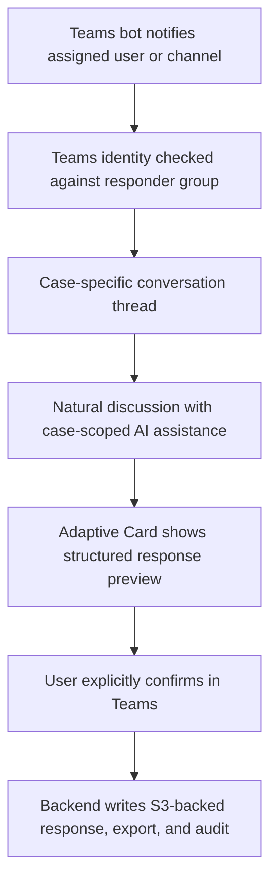
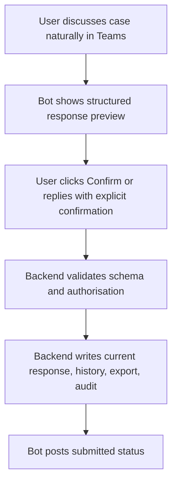
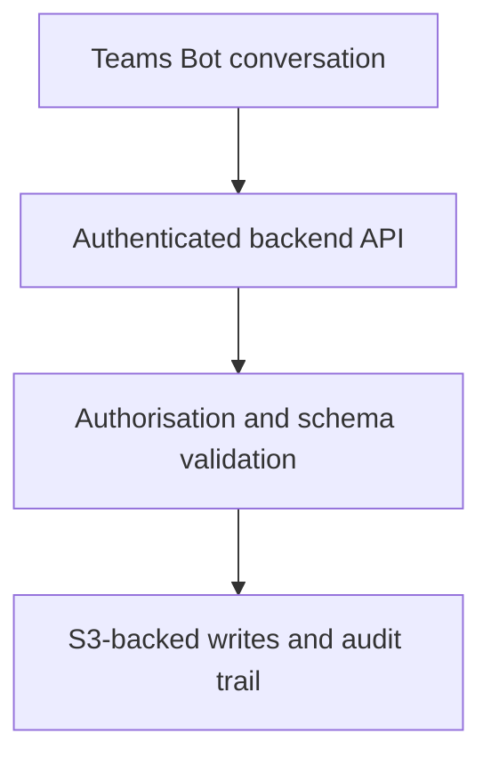
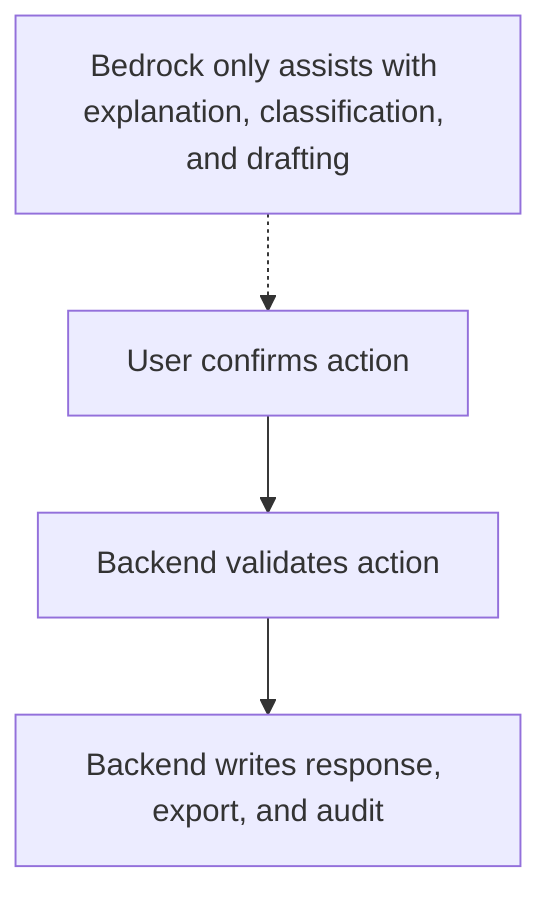
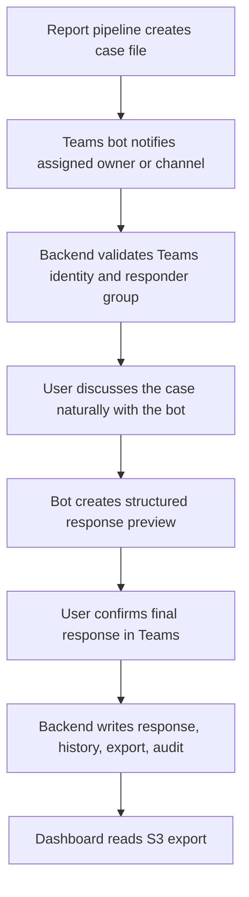
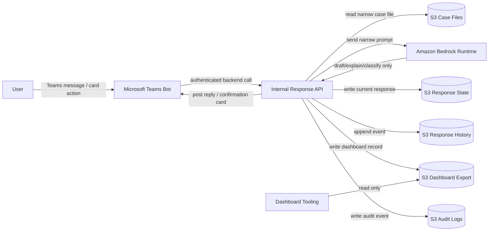

# FinOps Response Portal MVP

## Purpose

This MVP defines the smallest useful version of the AI-assisted FinOps response workflow.

The goal is not to build a broad FinOps agent. The goal is to remove the slowest, most manual part of the current process:

- FinOps sends a report item to the owning team.
- The team needs enough context to respond.
- The response must be structured, auditable, and dashboard-ready.
- Reassignment and disputes must be captured without mutating catalogues or AWS resources.

The MVP delivers one controlled response workflow for one report feed, one approved model, one Teams bot conversation interface, and S3-backed state/export.

## MVP Outcome

At the end of the MVP, FinOps can ask a user to respond to a specific report item inside Teams. The user discusses the case naturally with a bot, reviews a structured summary inside the conversation, explicitly confirms the response, and the system writes an auditable S3-backed output that dashboards can consume.

The value is:

| Value | MVP Mechanism |
| --- | --- |
| Faster responses | Case-specific explanation and guided response |
| Better dashboard commentary | Structured response schema |
| Lower chasing effort | Status captured centrally |
| Safer AI adoption | Bedrock only assists; backend owns all writes |
| Clear audit trail | View, draft, submit, and export events recorded |

## MVP Visual Overview

The whole MVP can be understood as a controlled conversational response loop. Users receive a Teams prompt, discuss the assigned FinOps case with a bot, confirm a structured response inside Teams, then the backend writes S3-backed outputs for audit and dashboarding.

```visual-overview
entry: Teams bot notification
interface: Teams conversation thread
assistant: Case-scoped AI discussion and drafting
control: User confirmation and backend validation
storage: S3 case files, responses, audit, dashboard export
dashboard: FinOps dashboard and review workflow
```

## Conversation Interface Model

The MVP has one canonical user interface: a Microsoft Teams bot conversation.

The user should be able to complete the MVP without opening a separate web page. The bot can use Teams messages and Adaptive Cards to present the issue, ask clarifying questions, collect the response, and request final confirmation.



### Primary Interface: Teams Bot Conversation

The user interacts with one Teams conversation for one report item. That conversation may be a direct chat with the assigned owner or a channel thread where the assigned responder group is authorised to reply.

The bot must make three things obvious immediately:

| Question | Bot Answer |
| --- | --- |
| What is this issue? | Teams message or Adaptive Card with summary, cost delta, service, period, and current owner |
| Why did I receive it? | Assigned team/application/product and authorised responder group |
| What can I do now? | Reply naturally, ask for explanation, or choose one of the controlled response actions |

Minimum Teams conversation elements:

| Area | Contents |
| --- | --- |
| Initial bot message | Issue ID, report period, service, cost delta, status, due date |
| Assignment context | Product, application, team, responder group |
| Evidence summary | Source report reference, detected drivers, dashboard reference if present |
| Natural discussion | User can ask questions and explain the situation in plain language |
| Bot guidance | Plain-English explanation, follow-up questions, category suggestions |
| Response capture | Bot maps the conversation to justification, dispute, reassignment, or investigation |
| Confirmation card | Structured response preview with Confirm, Edit, and Cancel actions |
| Audit events | View/notify, assist, draft, confirm, submit, and write events |

The bot is not a broad FinOps chatbot. Each conversation is scoped to one authorised case unless the user explicitly asks to switch to another assigned case.

### User Actions

The user gets four primary actions.

| Action | Teams Pattern | Backend Result |
| --- | --- | --- |
| Provide justification | User explains naturally; bot drafts structured justification for confirmation | `justified` response written |
| Dispute issue | User challenges data, amount, service, or allocation; bot captures structured reason | `disputed` response written |
| Request reassignment | User names proposed owner/application/team; bot captures reassignment request | `reassignment_requested` response written |
| Mark needs investigation | User says they need time or more evidence; bot captures reason and next step | investigation state written |

Secondary actions:

| Action | MVP Behaviour |
| --- | --- |
| Ask for explanation | AI explains the current case file only |
| Improve wording | AI drafts clearer finance-friendly wording |
| Classify response | AI suggests controlled category; user confirms |
| Attach evidence link | User pastes URL/reference metadata; backend validates shape |
| Cancel | No response write; audit may record view/session only |

### Final Submission Flow

Every final response follows the same pattern.



There is no hidden model action after the user confirms. The backend writes only the reviewed structured response.

### Email Interface

Email is optional in the MVP and is used for notification or escalation only. It should point the user back to Teams, not to a separate required web UI.

Minimum email content:

| Field | Example |
| --- | --- |
| Subject | `FinOps response required: Checkout API EC2 increase` |
| Issue summary | `EC2 spend increased by £18.5k for May 2026` |
| Assigned owner | `Payments / Checkout API / Payments Platform` |
| Due date | `2026-06-07` |
| Action link | `Open Teams conversation` |

The email link contains report ID and issue ID only. It does not grant access by itself.

```text
https://teams.microsoft.com/l/chat/0/0?users=finops-response-bot@company.com&topicName=finops-2026-05-001234
```

### Teams Interface

Teams is the MVP interface. The bot should call the same backend API for every read, model assist, draft, validation, confirmation, write, and audit event.

MVP Teams scope:

| Teams Feature | MVP Use |
| --- | --- |
| Bot notification | Tell assigned user or team a response is required |
| Natural-language chat | Let the user ask questions, explain context, dispute, or request reassignment |
| Adaptive Card | Show summary, due date, status, suggested category, and confirmation actions |
| Reminder message | Notify before due date or when status changes |
| Final confirmation | User confirms the structured response inside Teams |

Complex justification, disputes, reassignment, and evidence review should still happen through the bot conversation. If the conversation becomes ambiguous, the bot should ask targeted follow-up questions and require explicit confirmation before submission.

Teams card actions:

| Button | Behaviour |
| --- | --- |
| Explain | Calls backend; returns case-scoped explanation |
| Draft response | Converts the conversation into a structured preview |
| Confirm response | Submits the reviewed structured response |
| Edit response | Reopens the draft in the Teams conversation |
| Mark needs investigation | Captures reason and proposed next step |
| Request reassignment | Captures proposed owner/application/team |

The safe pattern is:



## Conversation State Model

The bot should expose state clearly in the thread and in any card it posts.

| State | Meaning | User Experience |
| --- | --- | --- |
| Awaiting response | No final response submitted | Bot has prompted the owner and can answer case questions |
| In discussion | User has started but not submitted | Bot can continue asking follow-up questions |
| Awaiting confirmation | Structured draft exists | Bot shows preview and asks for explicit confirmation |
| Submitted | Final response written | Bot posts submitted summary plus audit reference |
| Pending FinOps review | Dispute or unclear response needs review | Bot tells the user FinOps review is pending |
| Reassignment requested | Proposed new owner captured | Bot tells the user reassignment is pending approval |
| Closed | No further action needed | Bot posts read-only summary if asked |

## Interface Acceptance Criteria

| Requirement | Acceptance Test |
| --- | --- |
| User understands why they received the case | Bot message shows current assignment and responder group |
| User understands the financial issue | Bot message or card shows period, service, cost delta, and drivers |
| User can act without free-form email | Four controlled response outcomes can be reached from Teams |
| User can review before submit | Bot shows structured preview before final write |
| AI assistance is bounded | Bot only references current case context |
| Teams/email are not security boundaries | Backend validates Teams identity and responder-group membership |
| Dashboard data is produced | Submit creates dashboard export record |
| Audit is complete | View, assist, submit, and write events are recorded |

## Non-Negotiable Constraint

The model is not the system of record and does not write to AWS services.



## Smallest Useful Scope

### In Scope

| Capability | MVP Definition |
| --- | --- |
| One report source | A pre-built case file per report item |
| One primary interface | Teams bot conversation with Adaptive Card checkpoints |
| Optional email notification | Email can remind or escalate, but Teams remains the response interface |
| One model | One approved Bedrock text model |
| Four response types | Justification, dispute, reassignment request, needs investigation |
| S3-backed storage | Case files, current response, history, export, audit |
| Dashboard export | One S3 prefix with dashboard-ready JSON or Parquet |
| Audit events | Views, model assists, submissions, export writes |

### Out of Scope

| Excluded | Reason |
| --- | --- |
| Autonomous remediation | Not required to capture FinOps responses |
| Raw CUR access from the app | Case files are generated upstream |
| Live AWS infrastructure inspection | The app does not diagnose resources directly |
| IAM, tag, billing, or catalogue mutation | MVP captures requests only |
| Broad chatbot over all cost data | Interaction is scoped to one case |
| Dedicated web response UI | Not needed for the MVP; Teams is the user-facing interface |
| Direct browser-to-S3 writes | Backend must validate and audit all writes |
| Multiple model providers | One approved model is enough to prove value |

## MVP User Journey



## MVP Architecture



## Case File Contract

The upstream report pipeline creates one case file per report item. The MVP app reads this file; it does not query raw CUR directly.

Minimum case file:

```json
{
  "issue_id": "finops-2026-05-001234",
  "report_id": "monthly-cloud-report-2026-05",
  "report_period": "2026-05",
  "status": "awaiting_response",
  "assigned_team": "Payments Platform",
  "assigned_product": "Payments",
  "assigned_application": "Checkout API",
  "service": "AmazonEC2",
  "cost_delta": 18500.25,
  "currency": "GBP",
  "summary": "EC2 spend increased materially versus prior month.",
  "detected_drivers": [
    "c7g.4xlarge running hours increased",
    "EBS gp3 usage increased",
    "Production autoscaling floor appears higher"
  ],
  "allowed_responder_groups": [
    "payments-platform"
  ],
  "response_due_date": "2026-06-07"
}
```

## Response Types

| Type | User Intent | Final Status |
| --- | --- | --- |
| Justification | Accept the spend and explain why | `justified` |
| Dispute | Challenge data, amount, service, or allocation | `disputed` |
| Reassignment request | Suggest a different owner | `reassignment_requested` |
| Needs investigation | Cannot explain yet | `in_discussion` or `pending_finops_review` |

## Response Contract

The backend writes one current response and one immutable history event.

```json
{
  "issue_id": "finops-2026-05-001234",
  "response_id": "resp-001",
  "response_type": "justification",
  "status": "justified",
  "submitted_by": "user@company.com",
  "submitted_at": "2026-05-21T14:30:00Z",
  "justification_category": "expected_business_growth",
  "business_reason": "Traffic increased due to new merchant onboarding.",
  "technical_reason": "Additional production capacity was required.",
  "expected_to_continue": true,
  "requires_finops_review": false,
  "ai_summary": "The team accepted the increase as expected business growth."
}
```

## Dashboard Export Contract

The dashboard does not need the full transcript. It needs a compact, trusted record.

```json
{
  "report_period": "2026-05",
  "issue_id": "finops-2026-05-001234",
  "product": "Payments",
  "application": "Checkout API",
  "team": "Payments Platform",
  "service": "AmazonEC2",
  "cost_delta": 18500.25,
  "currency": "GBP",
  "status": "justified",
  "response_type": "expected_business_growth",
  "response_summary": "Increase accepted due to merchant onboarding and higher baseline capacity.",
  "submitted_by": "user@company.com",
  "submitted_at": "2026-05-21T14:30:00Z",
  "requires_finops_review": false,
  "requires_catalog_update": false
}
```

## S3 Layout

Use one bucket or approved bucket set. Keep prefixes explicit.

```text
s3://<bucket>/case-files/report_period=2026-05/issue_id=finops-2026-05-001234.json
s3://<bucket>/responses-current/report_period=2026-05/issue_id=finops-2026-05-001234.json
s3://<bucket>/responses-history/report_period=2026-05/issue_id=finops-2026-05-001234/event_ts=...json
s3://<bucket>/dashboard-export/report_period=2026-05/team=payments-platform/part-....json
s3://<bucket>/audit/report_period=2026-05/issue_id=finops-2026-05-001234/event_ts=...json
```

## Authorisation Rule

```gherkin
User is authenticated
AND user belongs to the assigned responder group OR FinOps admin group
AND issue exists
AND issue is open
AND requested response type is allowed
AND final response passes schema validation
```

## Prompt Boundary

The model receives only:

| Context | Included |
| --- | --- |
| Issue summary | Yes |
| Current assignment | Yes |
| Detected drivers | Yes |
| Allowed response types | Yes |
| User draft response | Yes |
| Raw CUR | No |
| Other teams' issues | No |
| AWS write credentials | No |
| Catalogue write access | No |

The model may return:

- Plain-English explanation.
- Follow-up question.
- Suggested response category.
- Draft summary.
- Confidence or review flag.

The model may not:

- Submit a response without confirmation.
- Write S3.
- Change assignment directly.
- Claim a root cause without evidence.
- Access unrelated data.

## Minimum AWS Ask

| Area | MVP Ask |
| --- | --- |
| Runtime | One private ECS, Lambda, or approved internal app runtime |
| Auth | Teams identity mapped to enterprise email and responder-group claims |
| Bedrock | Invoke one approved model in one approved region |
| Network | Private route to Bedrock Runtime, S3, KMS, CloudWatch Logs, Secrets Manager if used |
| S3 read | Case file prefix only |
| S3 write | Responses current/history, dashboard export, audit prefixes |
| KMS | Decrypt case files; encrypt/decrypt written objects |
| Logs | Runtime logs and business audit events |

## MVP Success Criteria

| Criterion | Evidence |
| --- | --- |
| User can respond to a case | Submitted response exists in S3 current prefix |
| Response is structured | JSON schema validation passes |
| Dashboard can consume output | Export record appears in dashboard prefix |
| AI is controlled | Bedrock has no direct S3/catalogue/AWS write path |
| Access is scoped | Unauthorised user cannot view or submit case |
| Audit is complete | View, model assist, submit, and export events exist |
| FinOps review is possible | Dispute and reassignment requests are visible |

## MVP Build Order

| Step | Deliverable |
| --- | --- |
| 1 | Case file schema and sample report item |
| 2 | Teams bot registration, command surface, and notification/card templates |
| 3 | Backend read/authorisation path using Teams identity and responder groups |
| 4 | Bedrock explanation and guided conversational drafting |
| 5 | Deterministic confirmation and submit endpoint |
| 6 | S3 current/history/export/audit writes |
| 7 | Dashboard reads export prefix |
| 8 | Pilot with one team, one Teams channel, and one report period |

## Final MVP Statement

Build one Teams bot response workflow for one report feed.

Use Bedrock only to explain, ask, classify, and draft.

Use deterministic backend logic for all validation, authorisation, state changes, S3 writes, and audit.

Publish one dashboard-ready S3 export.

Do not remediate, mutate catalogues, inspect live infrastructure, or expose broad cost data.
