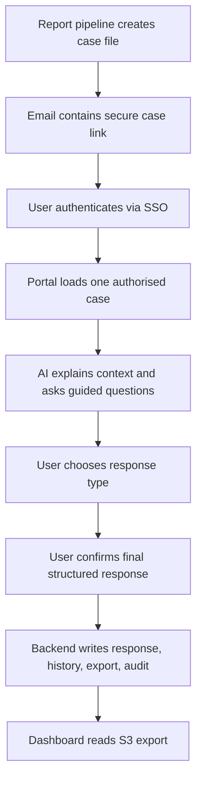
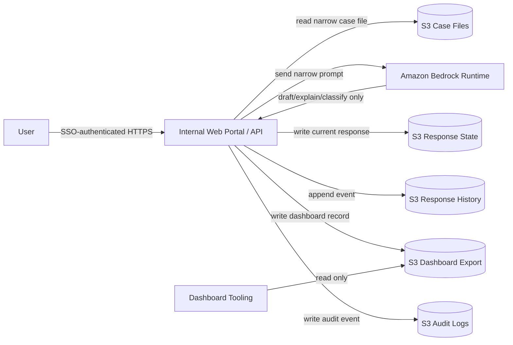

# FinOps Response Portal MVP

## Purpose

This MVP defines the smallest useful version of the AI-assisted FinOps response workflow.

The goal is not to build a broad FinOps agent. The goal is to remove the slowest, most manual part of the current process:

- FinOps sends a report item to the owning team.
- The team needs enough context to respond.
- The response must be structured, auditable, and dashboard-ready.
- Reassignment and disputes must be captured without mutating catalogues or AWS resources.

The MVP delivers one controlled response workflow for one report feed, one approved model, one authenticated internal UI, and S3-backed state/export.

## MVP Outcome

At the end of the MVP, FinOps can send a user a secure link for a specific report item. The user authenticates, reviews AI-assisted context, submits a controlled response, and the system writes an auditable S3-backed output that dashboards can consume.

The value is:

| Value | MVP Mechanism |
| --- | --- |
| Faster responses | Case-specific explanation and guided response |
| Better dashboard commentary | Structured response schema |
| Lower chasing effort | Status captured centrally |
| Safer AI adoption | Bedrock only assists; backend owns all writes |
| Clear audit trail | View, draft, submit, and export events recorded |

## Non-Negotiable Constraint

The model is not the system of record and does not write to AWS services.

```text
User confirms action
Backend validates action
Backend writes response/export/audit
Bedrock only assists with explanation, classification, and drafting
```

## Smallest Useful Scope

### In Scope

| Capability | MVP Definition |
| --- | --- |
| One report source | A pre-built case file per report item |
| One notification route | Email deep link to the internal app |
| One authenticated UI | Web page with case details and guided chat |
| One model | One approved Bedrock text model |
| Four response types | Justification, dispute, reassignment request, needs investigation |
| S3-backed storage | Case files, current response, history, export, audit |
| Dashboard export | One S3 prefix with dashboard-ready JSON or Parquet |
| Audit events | Views, model assists, submissions, export writes |

### Out of Scope

| Excluded | Reason |
| --- | --- |
| Autonomous remediation | Not required to capture FinOps responses |
| Raw CUR access from the app | Case files are generated upstream |
| Live AWS infrastructure inspection | The app does not diagnose resources directly |
| IAM, tag, billing, or catalogue mutation | MVP captures requests only |
| Broad chatbot over all cost data | Interaction is scoped to one case |
| Direct browser-to-S3 writes | Backend must validate and audit all writes |
| Multiple model providers | One approved model is enough to prove value |

## MVP User Journey



## MVP Architecture



## Case File Contract

The upstream report pipeline creates one case file per report item. The MVP app reads this file; it does not query raw CUR directly.

Minimum case file:

```json
{
  "issue_id": "finops-2026-05-001234",
  "report_id": "monthly-cloud-report-2026-05",
  "report_period": "2026-05",
  "status": "awaiting_response",
  "assigned_team": "Payments Platform",
  "assigned_product": "Payments",
  "assigned_application": "Checkout API",
  "service": "AmazonEC2",
  "cost_delta": 18500.25,
  "currency": "GBP",
  "summary": "EC2 spend increased materially versus prior month.",
  "detected_drivers": [
    "c7g.4xlarge running hours increased",
    "EBS gp3 usage increased",
    "Production autoscaling floor appears higher"
  ],
  "allowed_responder_groups": [
    "payments-platform"
  ],
  "response_due_date": "2026-06-07"
}
```

## Response Types

| Type | User Intent | Final Status |
| --- | --- | --- |
| Justification | Accept the spend and explain why | `justified` |
| Dispute | Challenge data, amount, service, or allocation | `disputed` |
| Reassignment request | Suggest a different owner | `reassignment_requested` |
| Needs investigation | Cannot explain yet | `in_discussion` or `pending_finops_review` |

## Response Contract

The backend writes one current response and one immutable history event.

```json
{
  "issue_id": "finops-2026-05-001234",
  "response_id": "resp-001",
  "response_type": "justification",
  "status": "justified",
  "submitted_by": "user@company.com",
  "submitted_at": "2026-05-21T14:30:00Z",
  "justification_category": "expected_business_growth",
  "business_reason": "Traffic increased due to new merchant onboarding.",
  "technical_reason": "Additional production capacity was required.",
  "expected_to_continue": true,
  "requires_finops_review": false,
  "ai_summary": "The team accepted the increase as expected business growth."
}
```

## Dashboard Export Contract

The dashboard does not need the full transcript. It needs a compact, trusted record.

```json
{
  "report_period": "2026-05",
  "issue_id": "finops-2026-05-001234",
  "product": "Payments",
  "application": "Checkout API",
  "team": "Payments Platform",
  "service": "AmazonEC2",
  "cost_delta": 18500.25,
  "currency": "GBP",
  "status": "justified",
  "response_type": "expected_business_growth",
  "response_summary": "Increase accepted due to merchant onboarding and higher baseline capacity.",
  "submitted_by": "user@company.com",
  "submitted_at": "2026-05-21T14:30:00Z",
  "requires_finops_review": false,
  "requires_catalog_update": false
}
```

## S3 Layout

Use one bucket or approved bucket set. Keep prefixes explicit.

```text
s3://<bucket>/case-files/report_period=2026-05/issue_id=finops-2026-05-001234.json
s3://<bucket>/responses-current/report_period=2026-05/issue_id=finops-2026-05-001234.json
s3://<bucket>/responses-history/report_period=2026-05/issue_id=finops-2026-05-001234/event_ts=...json
s3://<bucket>/dashboard-export/report_period=2026-05/team=payments-platform/part-....json
s3://<bucket>/audit/report_period=2026-05/issue_id=finops-2026-05-001234/event_ts=...json
```

## Authorisation Rule

```gherkin
User is authenticated
AND user belongs to the assigned responder group OR FinOps admin group
AND issue exists
AND issue is open
AND requested response type is allowed
AND final response passes schema validation
```

## Prompt Boundary

The model receives only:

| Context | Included |
| --- | --- |
| Issue summary | Yes |
| Current assignment | Yes |
| Detected drivers | Yes |
| Allowed response types | Yes |
| User draft response | Yes |
| Raw CUR | No |
| Other teams' issues | No |
| AWS write credentials | No |
| Catalogue write access | No |

The model may return:

- Plain-English explanation.
- Follow-up question.
- Suggested response category.
- Draft summary.
- Confidence or review flag.

The model may not:

- Submit a response without confirmation.
- Write S3.
- Change assignment directly.
- Claim a root cause without evidence.
- Access unrelated data.

## Minimum AWS Ask

| Area | MVP Ask |
| --- | --- |
| Runtime | One private ECS, Lambda, or approved internal app runtime |
| Auth | Enterprise SSO with email and group claims |
| Bedrock | Invoke one approved model in one approved region |
| Network | Private route to Bedrock Runtime, S3, KMS, CloudWatch Logs, Secrets Manager if used |
| S3 read | Case file prefix only |
| S3 write | Responses current/history, dashboard export, audit prefixes |
| KMS | Decrypt case files; encrypt/decrypt written objects |
| Logs | Runtime logs and business audit events |

## MVP Success Criteria

| Criterion | Evidence |
| --- | --- |
| User can respond to a case | Submitted response exists in S3 current prefix |
| Response is structured | JSON schema validation passes |
| Dashboard can consume output | Export record appears in dashboard prefix |
| AI is controlled | Bedrock has no direct S3/catalogue/AWS write path |
| Access is scoped | Unauthorised user cannot view or submit case |
| Audit is complete | View, model assist, submit, and export events exist |
| FinOps review is possible | Dispute and reassignment requests are visible |

## MVP Build Order

| Step | Deliverable |
| --- | --- |
| 1 | Case file schema and sample report item |
| 2 | SSO-protected case page |
| 3 | Backend read/authorisation path |
| 4 | Bedrock explanation and guided response draft |
| 5 | Deterministic submit endpoint |
| 6 | S3 current/history/export/audit writes |
| 7 | Dashboard reads export prefix |
| 8 | Pilot with one team and one report period |

## Final MVP Statement

Build one SSO-protected response portal for one report feed.

Use Bedrock only to explain, ask, classify, and draft.

Use deterministic backend logic for all validation, authorisation, state changes, S3 writes, and audit.

Publish one dashboard-ready S3 export.

Do not remediate, mutate catalogues, inspect live infrastructure, or expose broad cost data.
